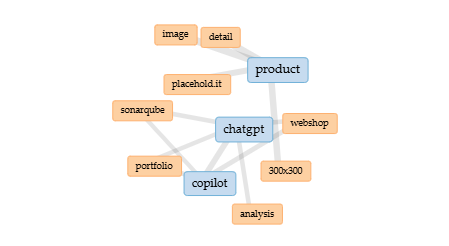
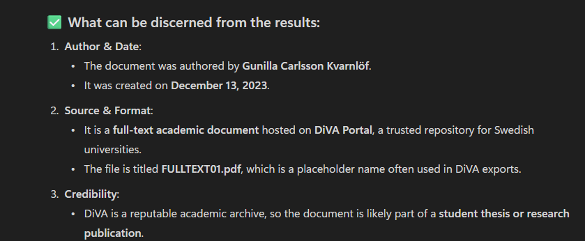
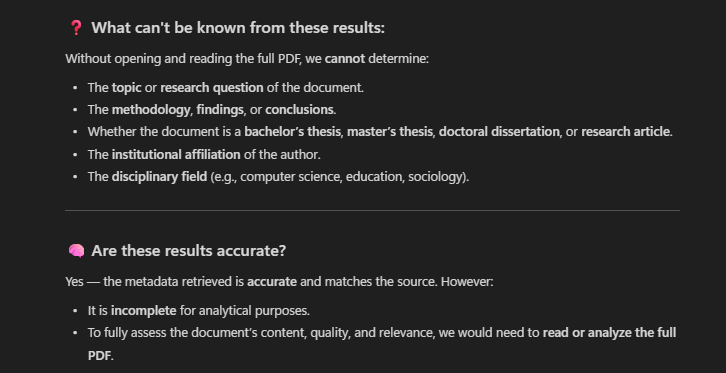



# Distant Reading Assignment 

I used Voyant to search this website! [Digitala Vetenskapliga Arkivet!](https://www.diva-portal.org/smash/record.jsf?pid=diva2%3A1769082&dswid=-7566)

I learned about the process and wheiter it was possible or not to create fully developed websites using AI. 

Check out my image!

---
I also tried Copilot, I did not use the new ChatGPT-5. Here's our conversation.

I learned that it can produce a summary of the provided text.

I learned it can provide what information is accurate and what can not be verified.

